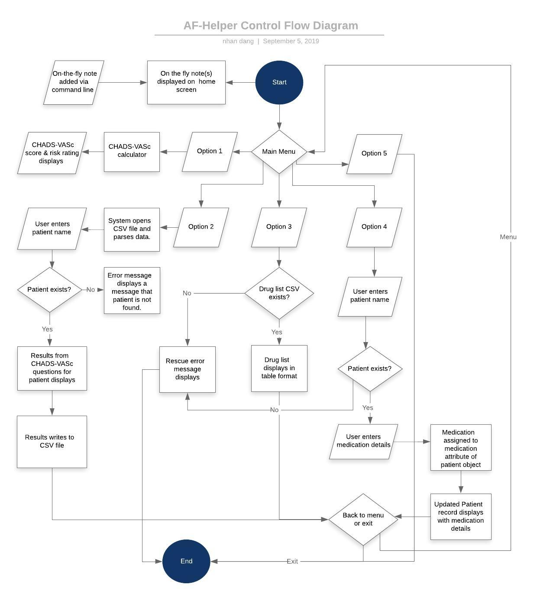

# **AF-Helper** #
The atrial fibrillation helper application.

## T1A2-1 Statement of Purpose and Scope ##

The AF-Helper is a terminal application designed to be used by doctors to identify the level of stroke risk in patients with atrial fibrillation.  
The standard method of identifying these patients is by calculating the CHADS-VASc score, which takes into consideration the patient's age, gender and disease history (vascular disease/diabetes/high blood pressure/previous history of stroke). Each item is assigned a score and the total score determines whether a patient is at low, moderate or high risk of stroke.  
CHADS-VASc calculators are readily available online but this requires the doctor to search for one every time, and the results are not stored and therefore are unable to be accessed at a later time. Information regarding risk status and oral anticoagulant recommendations are also scattered between different resources. The AF-Helper solves these problems by enabling doctors to access all of this information from one place without requiring access to the internet. The calculator calculates a CHADS-VASc score and stores the results for each patient which can be accessed later on via a search by patient name. A risk rating is provided at the time of performing the calculation based on the calculated CHADS-VASc score, and a succint list of medications is provided to guide prescribing.  
Aside from storing the CHADS-VASc results, doctors can add the anticoagulant prescribed for their patient to the result information for a more comprehensive record.  
The application also allows the doctor to enter freetext notes without having to launch the application directly from the terminal. These notes will display face-up to the doctor the next time they launch the application. This feature can be used to enter reminders to calculate a CHADS-VASc score for a patient or to review certain patients.

## T1A2-2 Features ##

### Home Screen ###
The home screen will display the main navigation menu. The menu is contained in the main application file (af-helper.rb). Each menu item aside from the exit option will execute by calling a method. To ensure that the code is modular the method(s) for each item will be stored in a separate file and the Class and instance methods will be stored in its own file. The menu will be wrapped in a loop so that when a feature has completed executing the user has the option of returning to the main menu without having to relaunch the application each time.  
To prevent errors caused by differing scope variables, global variables are only included in the main af-helper.rb file and each method returns a value which is assigned to these global variables.
A table has been added to the home screen to display notes added via the command line argument (ARGV) function. Since this note feature is intended to act as reminders for the doctor they are displayed face up upon opening the application.
A begin and rescue statement will wrap the menu loop to diplay a custom error messages for errors not otherwise addressed by method-specifi if/else statements.

### CHADS-VASc calculator ###
The CHADS-VASc calculator will call two different methods - one to calculate the score and one to evaluate the risk rating. These methods are grouped into the file chadsvasccalc.rb. Each answer will be associated with a score. A variable is used to keep track of the score and the system will add the scores as the user answers each question. Once all the questions have been answered, the application will return the total score which is the CHADs-VASc score. The patient name entered by the user at the start of the method, the answers and the CHADs-VASc score will be stored in a hash which is written to a CSV file to enable the information to be retrieved and viewed at subsequent uses of the application. The patient name is required to be captured to enable the result to be retrieved later on when the user searches for a record by patient name.  

**Stroke risk evaluator:** By using if and else statements based on the CHADS-VASc score, the application will inform the user if the patient is at a low, medium or high risk of stroke.  If the risk is medium or high, the user will be asked if they would like to select an anticoagulant therapy for the patient.** 

### Medication selector and record ** ###
A list of medicines and doses will be displayed to the user. The user will then select the medication to initiate and store this information along with the patient's name, CHADS-VASc score and stroke risk.   
**View record**: Users can select from 2 submenus:  
* View CHADS-VASc results for a patient  
* View patient medication record    

This method will open the CSV that the CHADS-VASc results have been written to and parse the data. 
This method is contained in the file resultviewer.rb.

### View drug list ###

The method for this option is contained in the file medications.rb. This method will open the file druglist.csv in read mode and parse the data to an array. From the array, the gem Terminal-Table is used to display the file's data containing a short list of anticoagulant medications in a table format.

### Add anticoagulant medication ###
This option calls on an instance method of the Patient Class and is contained in the file patient-class.rb.
The user is prompted to enter a patient's name which is stored in a variable.
The loadpatient method from the file resultviewer.rb is then called to open the CSV file containing the CHADS-VASc results to parse the patient data from the CSV to a hash to enable the values to instantiate an instance of the Patient Class. The user is prompted to enter the medication, and the setter method for the medication attribute is used to add the medication to the hash. This information is displayed back to the patient to confirm that the medication has been added. A feature to be added is for the updated record to write back to the CSV again. 

### Footnote ###
** Denotes that the feature has not yet been implemented.

## T1A2-4 User Interaction and Experience ##

### Home screen and navigation ###
The user will navigate to each feature from the menu on the home screen. Each menu item has numbered options and the user can navigate to the feature they would like to use by keying in the corresponding number. The last option will allow the user to exit the program. To prevent the application from terminating if the user makes an invalid selection, an else statement will be used to warn the user that the selection is invalid and loop back to the main menu. 
To make the application more appealing to end users the Ruby gems TTY-Font , Colorize and Terminal-Table were used to display some data throughout the application.

### CHADS-VASc calculator and risk evaluation ###
The Ruby gem TTY-Prompt will be used to enable users to select the answer option (mostly Yes/No) to reduce the incidence of invalid entries. If the user input is invalid (e.g. if the user types anything other than Y or N for a yes/no question), the rescue error message will display. As an enhacement, validate statements need to be added to the prompts to inform the user that their input invalid. The Colorize gem will be used to colour code the risk (blue for low, orange for moderate and red for high). Prior to loading the questions the system will check if the CSV file that the data is to write to cannot be found. If not, a custom error message will warn the user that the record cannot be saved to enable the user to proceed to calcate the CHADS-VASc score anyway without the application terminating unexpectedly.

### View CHADS-VASc results ###
The user must input a patient's name and only the record for the patient entered will display on the screen. 
If the patient does not have an existing record or if the user types invalid data (such as an empty string) the system will inform the user that the patient cannot be found, and provide an option for the user to return to the main menu via the loop on the main file.

### View drug list ###
The gem Terminal-Table is used to display the list of drugs in a table format. This is view only.

### Add anticoagulant medication ###
The user is prompted to enter the patient's name followed by the medication to add. The CHADS-VASc results and added medication will load to confirm to the user that the medication has been added.

### On-the-fly-notes ### 
A concise instruction on how to add on-the-fly notes has been included on the home screen to remind users how to add the notes and provide context. The notes are intended to be used as sticky notes or reminders (such as to remind the doctor to calculate a score for a particular patient) and will display face up to the user. The notes utilizes the ARGV functionality to enable the user to add them on-the-fly without having to open the AF-helper application. 

## T1A2-5 Control Flow Diagram ##
[PDF - Control Flow Diagram](./documentation/nhan-dang-T1A2-5-control-flow-diagram.pdf)

## T1A2-6 Implementation Plan ##
[Implementation Plan](./documentation/nhan-dang-T1A2—6-implementation-plan/xlsx)

## T1A2-7 Implement Application ##  
Run application in Terminal: `ruby af-helper.rb`

## T1A2-9 Style and Conventions ##  
Rubocop gem used for code styling and convention

# **TIA2-11 Help File** # 

## Installation Steps ##

### MAC OS: ###
1. Open Terminal
2. Clone the [Github repository](https://github.com/indianbread/af-helper-terminal-app) `git clone <url>`
3. `cd` into the directory where the repository was cloned to
4. In the command line, execute the [build.sh](./build.sh) file by typing `./build.sh`
5. Run the AF-Helper application by typing `ruby af-helper.rb` in the command line

## Dependencies ##
Your computer must have the following installed:

* [Ruby](https://www.ruby-lang.org/en/documentation/installation/)  
 Suggested installation steps:  
    * First, install `Homebrew`
    * Then use Homebrew to install `rbenv`
* The following [Ruby gems:](https://rubygems.org/) which are included in the build file
    * Colorize
    * Terminal-Table
    * TTY-Prompt
    * TTY-Font

## Features ##

### On-The-Fly Notes ###
These notes can be added directly on the command line without opening the AF-Helper application itself.
To add a note, type `ruby af-helper.rb "Your note here" "Your second optional note here"` on the command line and press enter.
The next time the application is opened the note(s) will display face-up on the home screen in a table format.
The notes are free-text and intended to be used similar to sticky notes, for examples, as a reminder to calculate a score for a particular patient.

### Home Screen - Main Menu ###
The home screen contains the main menu. To access a feature, type the number corresponding to the feature and press enter.

### CHADS-VASc Calculator ###
The calculator can be accessed by selecting option 1 from the main menu. The patient name is required for data storage and retrieval. The questions can be answered by selecting the correct answer from the list using the up and down arrows, or by typing "Y" or "N" and pressing enter. The data will be stored and able to be retrieved by using the result viewer option.

### View CHADS-VASc Results ###
Results from a previous calculation can be viewed by selecting option 2 from the main menu. Type the patient's full name to view their CHADS-VASc result. 

### View anticoagulant drug list ###
This option can be accessed by selecting option 3 from the main menu. A list of recommended anticoagulant medications and corresponding doses will display in a table format.

### Add an anticoagulant medication for a patient ###
To add an anticoagulant medication to a patient's record, select option 4 from the main menu. After entering the patient's full name and the medication details, the updated CHADS-VASc record with the medication details will display on the screen.

## Error Messages ##
**Invalid selection!**
This error message may be encountered on the home screen. If an option other than numbers 1 to 5 is selected the "Invalid Selection!" error message will display.

**Error: Unable to save results. Continue anyway?**  
This error may be encountered when using the CHADS-VASc calculator (option 1). The system is unable to locate the file to save the CHADS-VASc calculator results.
The calculator will still calculate a result correctly but the information is unable to be saved.    

**Patient not found**  
This error may be encountered when attempting to view a CHADS-VASc result (option 2). If no results are recorded for the selected patient or if the patient's name is incorrect the system will display a "Patient not found" error message. 

**Something went wrong! This program will terminate. Please contact helpdesk for advice.**  
This error message will display for all other errors. Some possible causes may be due to a corrupt data file or an issue external to the AF-Helper application which prevents it from running correctly. If this error is encountered the application will close. It may be executed again after the issue is resolved.  

# T1A2-12 Manual Testing #
[Manual Test Script with Results](./documentation/nhan-dang-T1A2—12-manual-testing.xlsx)

# T1A2-13 Source Control #
[Terminal App GitHub Repository](https://github.com/indianbread/af-helper-terminal-app)

# T1A2-14 Project Management Platform #
Screenshots of Trello board included in Implementation Plan:  
[Implementation Plan](./documentation/nhan-dang-T1A2-6-implementation-plan.xlsx)

# T1A2-15 Automation #
[Code for testing automation](./automated-testing.rb)

